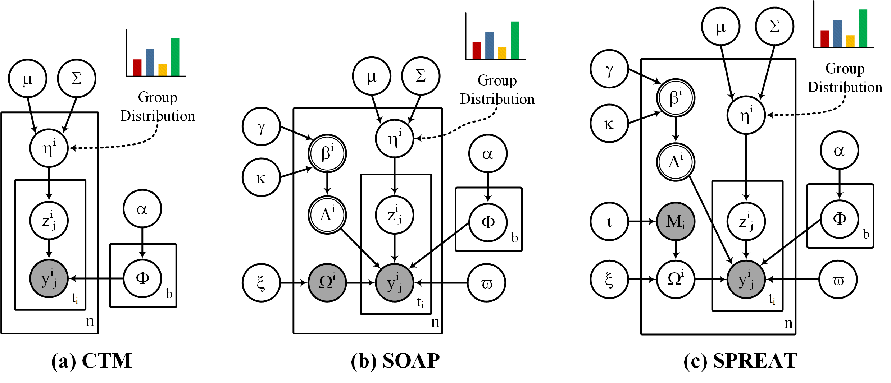

# CHAP: Modeling Metabolic Pathways as Groups (with Augmentation)



## Basic Description

This repo contains an implementation of CHAP (**C**orrelated pat**H**w**A**y-grou**P**) package which consists of three hierarchical Bayesian (parametric) mixture models, CTM (**C**orrelated **T**opic **M**odel), SOAP (**S**parse c**O**rrelated p**A**thway grou**P**) and SPREAT (di**S**tributed s**P**arse cor**RE**lated p**AT**hway group), that incorporate pathway abundance information to encode each example as a mixture distribution of groups, and each group, in turn, is a mixture of pathways with different mixing proportions. SOAP and SPREAT incorporate supplementary pathway (with different proportions) on top of the pathways provided in pathway datasets to partially resolve noisy pathway data. Moreover, SOAP and SPREAT induce dual sparseness, where we allow an example to select only a few groups and also each group to select its optimum set of pathways. While these models were proposed to model pathways among organims, they can be used for other types of datasets (e.g. natural language processing). We also included LDA (**L**atent **D**irichlet **A**llocation) which is implemented in [scikit-learn](https://scikit-learn.org/stable/).

## Dependencies

The codebase is tested to work under Python 3.7. To install the necessary requirements, run the following commands:

``pip install -r requirements.txt``

Basically, *CHAP* requires the following distribution and packages:

- [Anaconda](https://www.anaconda.com/)
- [NumPy](http://www.numpy.org/) (== 1.18.5)
- [scikit-learn](https://scikit-learn.org/stable/) (== 0.23)
- [scipy](https://www.scipy.org/index.html) (==1.5.0)
- [gensim](https://radimrehurek.com/gensim/) (==3.8.3)

## Experimental Objects and Test Samples

Please download the following files from [Zenodo](https://zenodo.org/record/5630322#.YX4KdGDMK3A). Once you have
downloaded the `cbt_materials.zip` file, unzip it and make sure you obtain the two folders: `model/` and `dataset/`, as
depicted below:

```
chap_materials/
	├── model/
        │       ├── ctm.pkl and ctm_[exp_omega | mu | sigma].npz
        │       ├── soap.pkl and soap_[exp_phi | mu | sigma].npz
        │       ├── spreat.pkl and spreat_[exp_phi | mu | sigma].npz
        │       └── ...
	└── dataset/
	        ├── biocyc_dictionary.pkl
	        ├── pnas_dictionary.pkl
	        ├── biocyc_features.pkl
                ├── biocyc_X.pkl, biocyc_text_X.pkl, biocyc_M.pkl
                ├── golden_X.pkl, golden_text_X.pkl, golden_M.pkl
                ├── cami_X.pkl, cami_text_X.pkl, cami_M.pkl
                ├── pnas_X.pkl, pnas_Xtrain.pkl, pnas_Xtest.pkl, pnas_text_X.pkl, pnas_text_Xtrain.pkl, pnas_text_Xtest.pkl
                └── ...
```				
A short description of the contents of the above folders is given below.

- "ctm.pkl" and "ctm_[exp_omega | mu | sigma].npz": a pretrained CTM model using biocyc_X data and associated files.
- "soap.pkl" and "soap_[exp_phi | mu | sigma].npz": a pretrained SOAP model using biocyc_X data and associated files.
- "spreat.pkl" and "spreat_[exp_phi | mu | sigma].npz": a pretrained SPREAT model using biocyc_X data and associated files.
- "biocyc_dictionary.pkl": a Dictionary object (from gensim) consists of 2526 distinct tokens (pathways).
- "biocyc_features.pkl": a sample of embeddings (nodes, dimension size). Based on your tests, you need to generate features using [pathway2vec](https://github.com/hallamlab/pathway2vec).
- "biocyc_X.pkl": BioCyc (v21 tier 2 \& 3) dataset of size (9429, 2526).
- "biocyc_text_X.pkl": A list of pathways for BioCyc (v21 tier 2 \& 3) dataset of size (9429 samples).
- "biocyc_M.pkl": Supplementary pathways for BioCyc (v21 tier 2 \& 3) dataset of size (9429, 2526).
- "golden_X.pkl": Golden dataset of size (63, 2526). First six examples correspond to: AraCyc, EcoCyc, HumanCyc, LeishCyc, TrypanoCyc, and YeastCyc.
- "golden_text_X.pkl": A list of pathways for golden dataset of size (63 samples). First six examples correspond to: AraCyc, EcoCyc, HumanCyc, LeishCyc, TrypanoCyc, and YeastCyc.
- "golden_M.pkl": Supplementary pathways for golden dataset of size (63, 2526). First six examples correspond to: AraCyc, EcoCyc, HumanCyc, LeishCyc, TrypanoCyc, and YeastCyc.
- "cami_X.pkl": CAMI dataset of size (40, 2526).
- "cami_text_X.pkl": A list of pathways for CAMI dataset of size (40 samples).
- "cami_M.pkl": Supplementary pathways for CAMI dataset of size (40, 2526).
- "pnas_dictionary.pkl": a Dictionary object (from gensim) consists of 26561 distinct tokens (words).
- "pnas_X.pkl": PNAS dataset of size (1391, 26561).
- "pnas_Xtrain.pkl": PNAS training dataset of size (1113, 26561).
- "pnas_Xtest.pkl": PNAS test dataset of size (278, 26561).
- "pnas_text_X.pkl": PNAS dataset (a list of strings) of size (1391 samples).
- "pnas_text_Xtrain.pkl": PNAS training dataset (a list of strings) of size (1113 samples).
- "pnas_text_Xtest.pkl": PNAS test dataset (a list of strings) of size (278 samples).

## Installation and Basic Usage

Run the following commands to clone the repository to an appropriate location:

``git clone https://github.com/arbasher/cbt``

For all experiments, navigate to ``src`` folder then run the commands of your choice. For example, to display *CHAP*'s running options use: `python main.py --help`. It should be self-contained.

### Training

For training, we provide few basic examples.

Description about arguments in all examples: *--num-components* corresponds the number of components (i.e., groups or topics), *--top-k* indicates the top k features (per component) to be considered for sparseness (SOAP and SPREAT only), *--max-sampling* is the maximum number of random samplings applied to SOAP and SPREAT only, *--vocab-name* is the file name for a Dictionary object (from gensim) containing vocabulary tokens (e.g. pathways or words), *--ssample-input-size* corresponds the  size of random subsampled inputs, *--fr* represents a hyper-parameter (set within the range of (0.5, 1.0]) to indicate the forgotten rate of the previous learned parameters, *--delay* is another hyper-parameter to down weights early iterations, *--batch* is batch size, *--num-jobs* corresponds the number of parallel workers, *--max-inner-iter* corresponds the number of inner iteration inside a single epoch, *--num-epochs* corresponds the number of iterations over the training set, and *--model-name* corresponds the name of the model excluding *EXTENSION*. The model name will have *.pkl* extension and an appropriate prefix (e.g. "soap_*.pkl"). The arguments *--X-name* is the input space of data (e.g. "biocyc_X.pkl" or "pnas_Xtrain.pkl"), *--M-name* is the supplementary data (same size as X), and *--features-name* corresponds the features of pathways obtained from [pathway2vec](https://github.com/hallamlab/pathway2vec).

The results of running all the commands below will be stored in two locations: *--mdpath* which contains the trained model with additional files and *--rspath* which has the cost file.

#### Example 1

If you wish to train LDA, CTM, SOAP, and SPREAT using a dataset (e.g. "biocyc_X.pkl"), execute the following command:

``python main.py --train --soap --spreat --ctm --lda --num-components 200 --top-k 10 --max-sampling 3 --ssample-input-size 0.1 --fr 0.9 --delay 1.0 --X-name "biocyc_X.pkl" --vocab-name "biocyc_dictionary.pkl" --model-name "[model name (without extension)]" --mdpath "[path to the model]" --dspath "[path to the dataset]" --rspath "[path to store the results (e.g. costs)]" --logpath "[path to the log directory]" --batch 50 --max-inner-iter 5 --num-epochs 10 --num-jobs 2``

#### Example 2

To train SOAP and SPREAT using a dataset (e.g. "biocyc_X.pkl") with **collapse2ctm** option, execute the following command:

``python main.py --train --soap --spreat --collapse2ctm --num-components 200 --max-sampling 3 --ssample-input-size 0.1 --fr 0.9 --delay 1.0 --X-name "biocyc_X.pkl" --vocab-name "biocyc_dictionary.pkl" --model-name "[model name (without extension)]" --mdpath "[path to the model]" --dspath "[path to the dataset]" --rspath "[path to store the results (e.g. costs)]" --logpath "[path to the log directory]" --batch 50 --max-inner-iter 5 --num-epochs 10 --num-jobs 2``

#### Example 3

To train SOAP and SPREAT using supplementary dataset (e.g. "biocyc_M.pkl") in addition to the original undistorted data (e.g. "biocyc_X.pkl"), enable **--use-supplement** argument and then execute the following command:

``python main.py --train --soap --spreat --use-supplement --top-k 20 --num-components 200 --max-sampling 3 --ssample-input-size 0.1 --fr 0.9 --delay 1.0 --X-name "biocyc_X.pkl" --M-name "biocyc_M.pkl" --vocab-name "biocyc_dictionary.pkl" --model-name "[model name (without extension)]" --mdpath "[path to the model]" --dspath "[path to the dataset]" --rspath "[path to store the results (e.g. costs)]" --logpath "[path to the log directory]" --batch 50 --max-inner-iter 5 --num-epochs 10 --num-jobs 2``

Note that the *--top-k* induces sparseness of pathway distribution over groups.

#### Example 4

To train SOAP and SPREAT using features and supplementary dataset (e.g. "biocyc_M.pkl") in addition to the original undistorted data (e.g. "biocyc_X.pkl"), enable **--use-supplement** and **--use-features** arguments and then execute the following command:

``python main.py --train --soap --spreat --use-supplement --use-features --top-k 20 --num-components 200 --max-sampling 3 --ssample-input-size 0.1 --fr 0.9 --delay 1.0 --X-name "biocyc_X.pkl" --M-name "biocyc_M.pkl" --vocab-name "biocyc_dictionary.pkl" --features-name "biocyc_features.pkl" --model-name "[model name (without extension)]" --mdpath "[path to the model]" --dspath "[path to the dataset]" --rspath "[path to store the results (e.g. costs)]" --logpath "[path to the log directory]" --batch 50 --max-inner-iter 5 --num-epochs 10 --num-jobs 2``

Note that the *--top-k* induces sparseness of pathway distribution over groups.

#### Example 5

You can train LDA, CTM, SOAP, and SPREAT using any other datasets (e.g. "pnas_Xtrain.pkl"), execute the following command:

``python main.py --train --soap --spreat --ctm --lda --num-components 200 --top-k 10 --max-sampling 3 --ssample-input-size 0.1 --fr 0.9 --delay 1.0 --X-name "pnas_Xtrain.pkl" --vocab-name "pnas_dictionary.pkl" --model-name "[model name (without extension)]" --mdpath "[path to the model]" --dspath "[path to the dataset]" --rspath "[path to store the results (e.g. costs)]" --logpath "[path to the log directory]" --batch 50 --max-inner-iter 5 --num-epochs 10 --num-jobs 2``

Also, you can train SOAP and SPREAT using the same dataset with **collapse2ctm** option:

``python main.py --train --soap --spreat --collapse2ctm --num-components 200 --max-sampling 3 --ssample-input-size 0.1 --fr 0.9 --delay 1.0 --X-name "pnas_Xtrain.pkl" --vocab-name "pnas_dictionary.pkl" --model-name "[model name (without extension)]" --mdpath "[path to the model]" --dspath "[path to the dataset]" --rspath "[path to store the results (e.g. costs)]" --logpath "[path to the log directory]" --batch 50 --max-inner-iter 5 --num-epochs 10 --num-jobs 2``

### Evaluating

For evaluating, we provide few basic examples. 

Description about arguments in all examples: *--top-k* in the evaluation setting entails the top k features (per component) to be considered for for computing the coherence score, *--cal-average* is a binary value indicating  whether to calculate the expected predictive distribution, *--vocab-name* is the file name for a Dictionary object (from gensim) containing vocabulary tokens (e.g. pathways or words), *--batch* is batch size, *--num-jobs* corresponds the number of parallel workers, *--num-epochs* corresponds the number of iterations over the training set, and *--model-name* corresponds the name of the learned model excluding *PREFIX* and *EXTENSION*. The model name will have *.pkl* extension. The arguments *--X-name* is the input space of data (e.g. "cami_X.pkl" or "pnas_Xtest.pkl") and *--text-name* is the input space of the same data but represented as a list of strings (e.g. "cami_text_X.pkl" or "pnas_text_Xtest.pkl") while the argument *--M-name* corresponds the supplementary data (same size as X). Finally, *--features-name* corresponds the features of pathways obtained from [pathway2vec](https://github.com/hallamlab/pathway2vec).

The results of running all the commands below will be stored in *--rspath* which contains the score files.

#### Example 1

To evaluate pretrained models of LDA, CTM, SOAP, and SPREAT using an appropriate dataset (e.g. "cami_X.pkl") with associated list of strings (e.g. "cami_text_X.pkl"), execute the following command:

``python main.py --evaluate --soap --spreat --ctm --lda --cal-average --top-k 10 --X-name "cami_X.pkl" --text-name "cami_text_X.pkl" --vocab-name "biocyc_dictionary.pkl" --model-name "[model name (without prefix and extension)]" --mdpath "[path to the model]" --dspath "[path to the dataset]" --rspath "[path to store the results (e.g. costs)]" --batch 50 --num-epochs 10 --num-jobs 2``

The same example applies for pretrained models (with **collapse2ctm** option) of SOAP and SPREAT.

#### Example 2

To evaluate pretrained models (with **--use-supplement** and **--use-features** arguments) of SOAP and SPREAT using an appropriate dataset (e.g. "cami_X.pkl") with associated list of strings (e.g. "cami_text_X.pkl"), execute the following command:

``python main.py --evaluate --soap --spreat --use-supplement --use-features --cal-average --top-k 10 --X-name "cami_X.pkl" --text-name "cami_text_X.pkl" --M-name "cami_M.pkl" --vocab-name "biocyc_dictionary.pkl" --features-name "biocyc_features.pkl" --model-name "[model name (without prefix and extension)]" --mdpath "[path to the model]" --dspath "[path to the dataset]" --rspath "[path to store the results (e.g. costs)]" --batch 50 --num-epochs 10 --num-jobs 2``

#### Example 3

To evaluate pretrained models of LDA, CTM, SOAP, and SPREAT using an text dataset (e.g. "pnas_Xtest.pkl") with associated list of strings (e.g. "pnas_text_Xtest.pkl"), execute the following command:

``python main.py --evaluate --soap --spreat --ctm --lda --cal-average --top-k 10 --X-name "pnas_Xtest.pkl" --text-name "pnas_text_Xtest.pkl" --vocab-name "pnas_dictionary.pkl" --model-name "[model name (without prefix and extension)]" --mdpath "[path to the model]" --dspath "[path to the dataset]" --rspath "[path to store the results (e.g. costs)]" --batch 50 --num-epochs 10 --num-jobs 2``

### Transforming

To transform data into components, we provide few examples. 

Description about arguments in all examples: *--batch* is batch size, *--num-jobs* corresponds the number of parallel workers, *--file-name* is the name of  file (without *PREFIX* and *EXTENSION*) of the transformed data, and *--model-name* corresponds the name of the learned model excluding *PREFIX* and *EXTENSION*. The model name will have *.pkl* extension. The argument *--X-name* is the input space of data (e.g. "cami_X.pkl" or "pnas_Xtest.pkl") while the argument *--M-name* corresponds the supplementary data (same size as X). Finally, *--features-name* corresponds the features of pathways obtained from [pathway2vec](https://github.com/hallamlab/pathway2vec).

The results of running all the commands below will be stored in *--dspath* which contains the transformed data.

#### Example 1

To transform a dataset (e.g. "cami_X.pkl") using pretrained models of SOAP, SPREAT, CTM, and LDA, execute the following command:

``python main.py --transform --soap --spreat --ctm --lda --X-name "cami_X.pkl" --model-name "[model name (without prefix and extension)]" --file-name "[the file name (without prefix and extension) of the transformed data]" --mdpath "[path to the model]" --dspath "[path to the dataset]" --batch 50 --num-jobs 2``

The same example applies for pretrained models (with **collapse2ctm** option) of SOAP and SPREAT.

#### Example 2

To transform a dataset (e.g. "cami_X.pkl") with supplementary pathways (e.g. "cami_M.pkl") using pretrained models (with **--use-supplement** and **--use-features** arguments) of SOAP and SPREAT, execute the following command:

``python main.py --transform --soap --spreat --use-supplement --use-features --X-name "cami_X.pkl" --M-name "cami_M.pkl" --features-name "biocyc_features.pkl" --model-name "[model name (without prefix and extension)]" --file-name "[the file name (without prefix and extension) of the transformed data]" --mdpath "[path to the model]" --dspath "[path to the dataset]" --batch 50 --num-jobs 2``

#### Example 3

To transform a text dataset (e.g. "pnas_Xtest.pkl") using pretrained models of SOAP, SPREAT, CTM, and LDA, execute the following command:

``python main.py --transform --soap --spreat --ctm --lda --X-name "pnas_Xtest.pkl" --model-name "[model name (without prefix and extension)]" --file-name "[the file name (without prefix and extension) of the transformed data]" --mdpath "[path to the model]" --dspath "[path to the dataset]" --batch 50 --num-jobs 2``

## Citing

If you find *CHAP* useful in your research, please consider citing the following paper:

- M. A. Basher, Abdur Rahman and Hallam, Steven J.. **["Aggregating statistically correlated metabolic pathways into groups to improve pathway prediction outcomes."](https://arbasher.github.io/data/chap.pdf)**, arXiv (2022).

## Contact

For any inquiries, please contact Steven Hallam and Abdurrahman Abul-Basher at: [shallam@mail.ubc.ca](mailto:shallam@mail.ubc.ca) and [arbasher@student.ubc.ca](mailto:arbasher@student.ubc.ca)